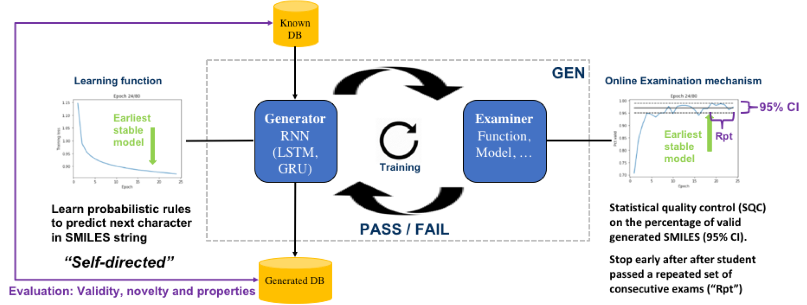

# Graph-GEN
This project contains the code used for the generation of graphs using the published method "Deep Generative Model for Sparse Graphs using Text-Based Learning with Augmentation in Generative Examination Networks 

## Reference
On using code for grpahs or modification for other text-based learning please refer to the original publication.

Please cite the following publication for any use of code or any parts thereof (including use of custom layers).

"GEN: Highly Efficient SMILES Explorer Using Autodidactic Generative Examination Networks"

Ruud van Deursena and Guillaume Godina

a Firmenich SA, Research and Development, Rue des Jeunes 1, CH-1227 Les Acacias, Geneva, Switzerland

## Publication links

<link to arxiv>

## License
The code is freely available under a Clause-3 BSD license (https://opensource.org/licenses/BSD-3-Clause).

## Dependencies

* Python 3.6
* RDKit
* Keras
* Tensorflow
* Numpy
* Scipy
* IPython
* Matplotlib

## Notification

The current version partially inherits functionality from RDKit (rdkit.org).

Time permitted this dependency will be resolved with a new LGI-writer and LGI-reader for networkx.Graph.
